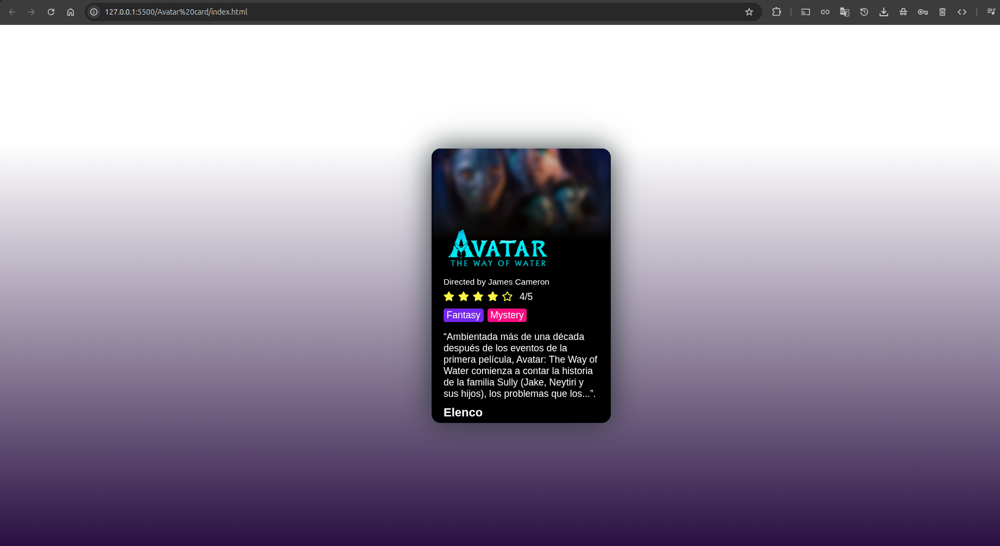

# Avatar Movie Card

Una tarjeta de película elegante y responsiva para "Avatar: The Way of Water" creada con HTML y CSS.

## Descripción

Este proyecto presenta una tarjeta de película interactiva que muestra información detallada sobre "Avatar: The Way of Water" dirigida por James Cameron. La tarjeta incluye póster, calificación, géneros, sinopsis y elenco principal.

## Características

- **Diseño Responsivo**: Se adapta a diferentes tamaños de pantalla
- **Información Completa**: Incluye póster, logo, director, calificación y sinopsis
- **Sistema de Calificación**: Visualización con estrellas (4/5 estrellas)
- **Etiquetas de Género**: Fantasy y Mystery
- **Galería de Elenco**: Imágenes del reparto principal
- **Iconos FontAwesome**: Para las estrellas de calificación

## Estructura del Proyecto

```
avatar-card/
├── index.html          # Archivo HTML principal
├── css/
│   └── style.css      # Estilos CSS
├── img/
│   ├── portada.jpg    # Póster de la película
│   └── logoavatar.png # Logo de Avatar
└── README.md          # Este archivo
```

## Tecnologías Utilizadas

- **HTML5**: Estructura semántica
- **CSS3**: Estilos y diseño responsivo
- **FontAwesome 5.5.0**: Iconos para el sistema de calificación
- **Google Static Content**: Imágenes del elenco

## Instalación y Uso

1. Clona o descarga el repositorio
2. Asegúrate de tener la estructura de carpetas correcta
3. Coloca las imágenes necesarias en la carpeta `img/`:
   - `portada.jpg`: Póster de la película
   - `logoavatar.png`: Logo de Avatar
4. Abre `index.html` en tu navegador web

## Contenido de la Tarjeta

- **Título**: Avatar: The Way of Water
- **Director**: James Cameron
- **Calificación**: 4/5 estrellas
- **Géneros**: Fantasy, Mystery
- **Sinopsis**: Breve descripción de la película
- **Elenco**: Galería de imágenes del reparto principal

## Dependencias Externas

- **FontAwesome**: Para los iconos de estrellas
  ```html
  <link rel="stylesheet" href="https://use.fontawesome.com/releases/v5.5.0/css/all.css">
  ```

## Personalización

Para personalizar la tarjeta con otra película:

1. Reemplaza las imágenes en la carpeta `img/`
2. Modifica el contenido HTML en `index.html`
3. Ajusta los estilos en `css/style.css` según sea necesario
4. Actualiza las URLs de las imágenes del elenco

## Compatibilidad

- Navegadores modernos (Chrome, Firefox, Safari, Edge)
- Diseño responsivo para dispositivos móviles y desktop
- Compatible con HTML5 y CSS3

## Contribución

Si deseas contribuir al proyecto:

1. Fork el repositorio
2. Crea una rama para tu feature (`git checkout -b feature/nueva-caracteristica`)
3. Commit tus cambios (`git commit -am 'Añade nueva característica'`)
4. Push a la rama (`git push origin feature/nueva-caracteristica`)
5. Crea un Pull Request

## Licencia

Este proyecto es de código abierto y está disponible bajo la licencia MIT.

## Autor

Desarrollado como proyecto de práctica para mejorar habilidades en HTML y CSS.

---

*Proyecto creado con fines educativos y de práctica en desarrollo web frontend.*

## Imagenes ilustrativas

