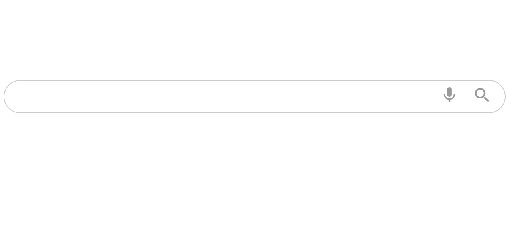

# Barra de Búsqueda

Este proyecto es una barra de búsqueda minimalista y responsiva creada con HTML y CSS.

## Características

- Diseño limpio y moderno.
- Adaptable a dispositivos móviles (responsiva).
- Incluye iconos de micrófono y búsqueda usando Google Material Icons.

## Archivos

- `index.html`: Contiene la estructura principal de la barra de búsqueda.
- `style.css`: Estilos para la barra y los botones.
- `charizard.png`: Ícono utilizado como favicon.

## Uso

1. Clona o descarga este repositorio.
2. Abre el archivo `index.html` en tu navegador web.

## Créditos

Fernando

## Imagen representativa

