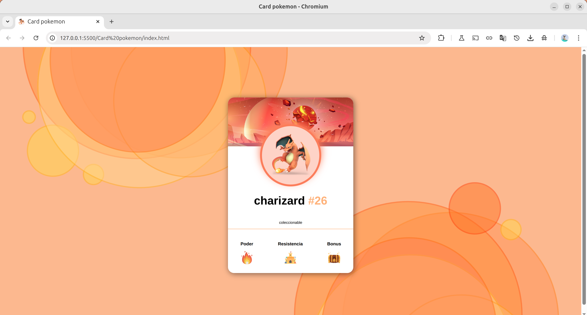

# Pokémon Card - Charizard

Una tarjeta coleccionable de Pokémon desarrollada con HTML y CSS, presentando a Charizard como personaje principal.

## 📋 Descripción

Este proyecto presenta una card interactiva de Pokémon diseñada con tecnologías web modernas. La tarjeta muestra información detallada del Pokémon Charizard incluyendo su imagen, número de identificación y características principales como poder, resistencia y bonus.

## 🚀 Características

- **Diseño responsivo**: Adaptable a diferentes tamaños de pantalla
- **Estructura semántica**: HTML5 con elementos semánticos apropiados
- **Iconografía personalizada**: Incluye íconos representativos para cada atributo
- **Favicon personalizado**: Ícono de Charizard en la pestaña del navegador

## 🛠️ Tecnologías Utilizadas

- **HTML5**: Estructura y contenido
- **CSS3**: Estilos y diseño visual
- **SVG**: Gráficos vectoriales para el fondo del encabezado
- **PNG**: Imágenes de alta calidad para personajes e íconos

## 📁 Estructura del Proyecto

```
pokemon-card/
│
├── index.html              # Archivo principal HTML
├── css/
│   └── style.css          # Estilos CSS (archivo requerido)
├── img/
│   ├── charizard.png      # Imagen principal del Pokémon
│   ├── fondoencabezado.svg # Fondo decorativo del encabezado
│   ├── fuego.png          # Ícono de poder
│   ├── castillo.png       # Ícono de resistencia
│   └── cofre.png          # Ícono de bonus
└── README.md              # Documentación del proyecto
```

## 🎯 Elementos de la Card

### Encabezado
- Fondo decorativo con imagen SVG
- Diseño visual atractivo

### Cuerpo Principal
- **Imagen**: Charizard en alta resolución (150px de ancho)
- **Título**: Nombre del Pokémon con número identificador (#26)
- **Descripción**: Clasificación como "coleccionable"

### Pie de Card
Tres secciones de atributos:
- **Poder**: Representado con ícono de fuego
- **Resistencia**: Representado con ícono de castillo
- **Bonus**: Representado con ícono de cofre

## 🚀 Instalación y Uso

1. **Clonar o descargar** el proyecto
2. **Crear el archivo CSS** faltante en la ruta `css/style.css`
3. **Asegurar** que todas las imágenes estén en la carpeta `img/`
4. **Abrir** `index.html` en un navegador web

## 📱 Compatibilidad

- ✅ Chrome (última versión)
- ✅ Firefox (última versión)
- ✅ Safari (última versión)
- ✅ Edge (última versión)

## 🎨 Personalización

El proyecto está diseñado para ser fácilmente personalizable:

- **Cambiar Pokémon**: Reemplazar imagen y datos en `index.html`
- **Modificar colores**: Actualizar variables CSS
- **Agregar animaciones**: Implementar transiciones CSS
- **Responsive design**: Adaptar breakpoints según necesidades

## 📝 Notas Técnicas

- El proyecto utiliza **HTML semántico** con elementos `<main>`, `<article>`, y estructura clara
- **Favicon personalizado** mejora la experiencia de usuario
- **Imágenes optimizadas** para web con tamaños apropiados
- **Código limpio** y bien documentado para fácil mantenimiento

## 🔧 Mejoras Sugeridas

- [ ] Implementar CSS Grid o Flexbox para mejor layout
- [ ] Agregar efectos hover y transiciones
- [ ] Crear versión responsive completa
- [ ] Implementar modo oscuro/claro
- [ ] Agregar más información del Pokémon

## 👨‍💻 Autor Fernando

Desarrollado como proyecto de práctica en desarrollo web frontend.

## 📄 Licencia

Este proyecto es de uso educativo y personal.

## Imagen ilustrativa

