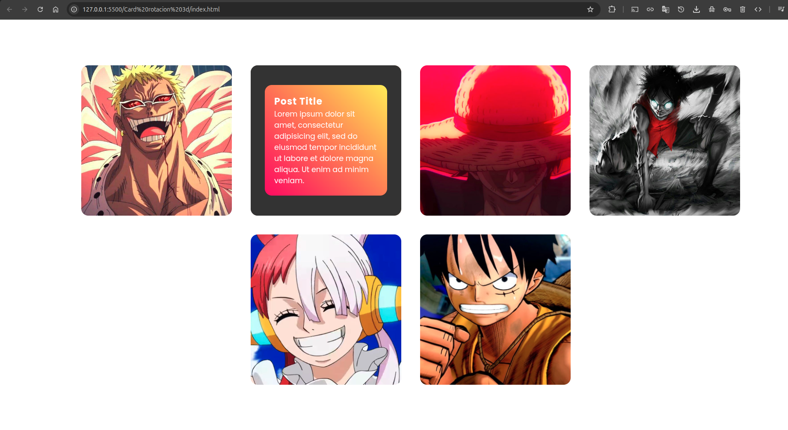

# Galería de Tarjetas Responsive

Una galería de tarjetas moderna y responsive desarrollada con HTML5 y CSS3, perfecta para mostrar posts, productos o contenido visual de manera elegante.

## 📋 Descripción

Este proyecto presenta una galería de tarjetas con diseño moderno que combina imágenes con contenido textual. Cada tarjeta incluye una imagen, título y descripción, organizadas en un layout responsive que se adapta a diferentes tamaños de pantalla.

## ✨ Características

- **Diseño responsive** - Se adapta automáticamente a dispositivos móviles, tablets y desktop
- **Tarjetas modernas** - Diseño limpio y minimalista con efectos visuales
- **Layout flexible** - Organización automática de tarjetas en grid
- **Efectos hover** - Interacciones suaves al pasar el mouse
- **Estructura semántica** - HTML5 bien estructurado
- **Optimizado para rendimiento** - Código limpio y eficiente

## 🛠️ Tecnologías utilizadas

- **HTML5** - Estructura semántica
- **CSS3** - Estilos modernos y efectos visuales
- **Responsive Design** - Media queries para adaptabilidad
- **Flexbox/Grid** - Layout moderno y flexible

## 📁 Estructura del proyecto

```
card-gallery/
│
├── index.html         # Página principal
├── css/
│   └── style.css     # Estilos CSS
├── img/              # Recursos de imágenes
│   ├── l1.jpg        # Imagen tarjeta 1
│   ├── l2.jpg        # Imagen tarjeta 2
│   ├── l3.jpg        # Imagen tarjeta 3
│   ├── l4.jpg        # Imagen tarjeta 4
│   ├── l5.jpg        # Imagen tarjeta 5
│   └── l6.jpg        # Imagen tarjeta 6
└── README.md         # Documentación del proyecto
```

## 🚀 Instalación y uso

### Método 1: Descarga directa

1. **Descarga o clona el repositorio**
   ```bash
   git clone https://github.com/tu-usuario/card-gallery.git
   ```

2. **Navega al directorio del proyecto**
   ```bash
   cd card-gallery
   ```

3. **Abre el archivo index.html en tu navegador**
   ```bash
   # En Windows
   start index.html
   
   # En macOS
   open index.html
   
   # En Linux
   xdg-open index.html
   ```

### Método 2: Live Server (recomendado)

1. **Instala Live Server** (si usas VS Code)
   - Extensión "Live Server" en VS Code
   - O usa `npm install -g live-server`

2. **Ejecuta el servidor local**
   ```bash
   live-server
   ```

3. **Abre en el navegador**
   ```
   http://localhost:5500
   ```

## 💻 Estructura del HTML

### Componente de Tarjeta

Cada tarjeta sigue esta estructura:

```html
<div class="card">
  <div class="box">
    <div class="imgBx">
      
    </div>
    <div class="contentBx">
      <div>
        <h2>Titulo</h2>
        <p>Descripción del contenido...</p>
      </div>
    </div>
  </div>
</div>
```

### Elementos principales:

- **`.card`** - Contenedor principal de cada tarjeta
- **`.box`** - Wrapper interno para efectos y transformaciones
- **`.imgBx`** - Contenedor de la imagen
- **`.contentBx`** - Contenedor del texto (título y descripción)

## 🎨 Personalización

### Agregar nuevas tarjetas

Para agregar una nueva tarjeta, copia y pega esta estructura:

```html
<div class="card">
  <div class="box">
    <div class="imgBx">
      
    </div>
    <div class="contentBx">
      <div>
        <h2>Tu Título</h2>
        <p>Tu descripción aquí...</p>
      </div>
    </div>
  </div>
</div>
```

### Modificar imágenes

1. **Reemplaza las imágenes** en la carpeta `img/`
2. **Mantén las dimensiones** similares para consistencia visual
3. **Actualiza las rutas** en el HTML si cambias los nombres

### Personalizar estilos

Edita `css/style.css` para modificar:
- **Colores** - Cambia la paleta de colores
- **Tipografía** - Modifica fuentes y tamaños
- **Espaciado** - Ajusta márgenes y padding
- **Efectos** - Personaliza transiciones y hover effects
- **Layout** - Modifica el grid y distribución

## 📱 Responsive Design

La galería está optimizada para:

- **📱 Mobile** (320px - 768px)
  - Tarjetas en columna única
  - Texto optimizado para pantallas pequeñas
  
- **📱 Tablet** (768px - 1024px)
  - 2-3 tarjetas por fila
  - Espaciado equilibrado
  
- **💻 Desktop** (1024px+)
  - 3-4 tarjetas por fila
  - Efectos hover completos

## 🌐 Compatibilidad

- ✅ Chrome 60+
- ✅ Firefox 55+
- ✅ Safari 12+
- ✅ Edge 79+
- ✅ Opera 47+
- ✅ IE 11 (con limitaciones)

## 🚀 Casos de uso

Esta galería es perfecta para:

- **📝 Blog posts** - Mostrar artículos recientes
- **🛍️ Productos** - Catálogo de productos
- **📷 Portfolio** - Galería de trabajos
- **👥 Equipo** - Presentación de miembros
- **📰 Noticias** - Sección de noticias
- **🎯 Servicios** - Descripción de servicios

## 🔧 Mejoras futuras

- [ ] Filtros por categoría
- [ ] Búsqueda en tiempo real
- [ ] Paginación
- [ ] Lightbox para imágenes
- [ ] Animaciones de entrada
- [ ] Integración con CMS
- [ ] Lazy loading de imágenes
- [ ] Modo oscuro/claro

## 📄 Licencia

Este proyecto está bajo la Licencia MIT. Ver el archivo `LICENSE` para más detalles.

## 🤝 Contribuciones

Las contribuciones son bienvenidas. Para contribuir:

1. Fork el proyecto
2. Crea una rama para tu feature (`git checkout -b feature/NuevaFuncionalidad`)
3. Commit tus cambios (`git commit -m 'Add: nueva funcionalidad'`)
4. Push a la rama (`git push origin feature/NuevaFuncionalidad`)
5. Abre un Pull Request

## 📞 Contacto

- **Autor:** Tu Nombre
- **Email:** tu.email@ejemplo.com
- **GitHub:** [@tu-usuario](https://github.com/tu-usuario)
- **LinkedIn:** [Tu Perfil](https://linkedin.com/in/tu-perfil)

## 📝 Notas

- Las imágenes de ejemplo son placeholders
- Optimiza las imágenes para web antes de usarlas
- Considera usar lazy loading para mejorar el rendimiento
- El proyecto es totalmente personalizable

---

⭐ Si te gustó este proyecto, ¡dale una estrella en GitHub!

## Imagenes ilustrativas

