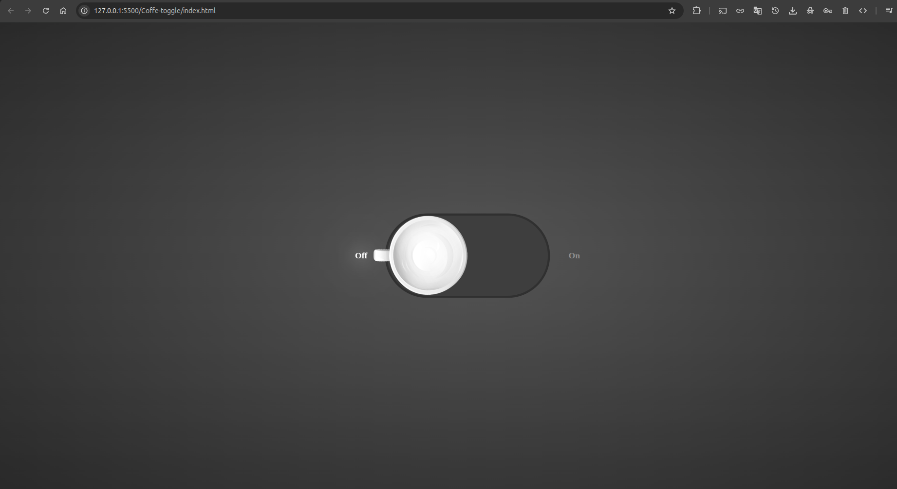

# Toggle Switch Coffee Theme

Un elegante toggle switch (interruptor) con temática de café, desarrollado con HTML5 y CSS3 puro. Perfecto para interfaces de usuario modernas que necesiten un control de encendido/apagado con estilo.

## 📋 Descripción

Este proyecto presenta un toggle switch minimalista y elegante con animaciones suaves. El diseño está inspirado en la temática del café, proporcionando una experiencia visual atractiva para controles de encendido/apagado, configuraciones de tema, o cualquier funcionalidad que requiera un estado binario.

## ✨ Características

- **CSS puro** - Sin dependencias de JavaScript
- **Animaciones suaves** - Transiciones elegantes al cambiar estado
- **Diseño minimalista** - Interfaz limpia y moderna
- **Tema café** - Colores y estética relacionada con café
- **Responsive** - Se adapta a diferentes tamaños de pantalla
- **Accesible** - Funciona con navegación por teclado
- **Lightweight** - Código mínimo y optimizado

## 🛠️ Tecnologías utilizadas

- **HTML5** - Estructura semántica con checkbox
- **CSS3** - Estilos modernos, transiciones y animaciones
- **Responsive Design** - Adaptable a diferentes dispositivos

## 📁 Estructura del proyecto

```
coffee-toggle-switch/
│
├── index.html        # Página principal
├── css/
│   └── style.css    # Estilos CSS y animaciones
└── README.md        # Documentación del proyecto
```

## 🚀 Instalación y uso

### Método 1: Descarga directa

1. **Descarga o clona el repositorio**
   ```bash
   git clone https://github.com/tu-usuario/coffee-toggle-switch.git
   ```

2. **Navega al directorio del proyecto**
   ```bash
   cd coffee-toggle-switch
   ```

3. **Abre el archivo index.html en tu navegador**
   ```bash
   # En Windows
   start index.html
   
   # En macOS
   open index.html
   
   # En Linux
   xdg-open index.html
   ```

### Método 2: Integración en tu proyecto

Copia el código HTML y CSS a tu proyecto existente:

```html
<label>
    <input type="checkbox"/>
    <span></span>
    <text>Off</text>
    <text>On</text>
</label>
```

## 💻 Estructura del HTML

### Componente principal

```html
<label>
    <input type="checkbox"/>    <!-- Control oculto -->
    <span></span>              <!-- Slider visual -->
    <text>Off</text>           <!-- Texto estado apagado -->
    <text>On</text>            <!-- Texto estado encendido -->
</label>
```

### Elementos clave:

- **`label`** - Contenedor principal clickeable
- **`input[type="checkbox"]`** - Control de estado (oculto)
- **`span`** - Slider visual del switch
- **`text`** - Etiquetas de estado Off/On

## 🎨 Personalización

### Cambiar textos

Para personalizar los textos del switch:

```html
<label>
    <input type="checkbox"/>
    <span></span>
    <text>Apagado</text>      <!-- Texto personalizado -->
    <text>Encendido</text>    <!-- Texto personalizado -->
</label>
```

### Modificar colores

Edita `css/style.css` para cambiar:
- **Colores del switch** - Fondos, bordes y slider
- **Colores de texto** - Estados Off/On
- **Colores hover** - Efectos de interacción
- **Tema** - Cambia de café a cualquier otro tema

### Ajustar tamaños

Modifica las dimensiones del switch:
- **Ancho y alto** del contenedor
- **Tamaño del slider** (span)
- **Tamaño de fuente** de los textos

## 📱 Responsive Design

El toggle switch está optimizado para:

- **📱 Mobile** (320px+)
  - Tamaño apropiado para touch
  - Textos legibles en pantallas pequeñas
  
- **📱 Tablet** (768px+)
  - Tamaño intermedio
  - Espaciado equilibrado
  
- **💻 Desktop** (1024px+)
  - Efectos hover completos
  - Tamaño estándar

## 🌐 Compatibilidad

- ✅ Chrome 60+
- ✅ Firefox 55+
- ✅ Safari 12+
- ✅ Edge 79+
- ✅ Opera 47+
- ✅ IE 11 (con limitaciones en animaciones)

## ♿ Accesibilidad

- **Navegación por teclado** - Funciona con Tab y Espacio
- **Screen readers** - Label asociado correctamente
- **Estados visuales** - Indicadores claros de On/Off
- **Contraste** - Colores accesibles

## 🚀 Casos de uso

Este toggle switch es perfecto para:

- **🌙 Modo oscuro/claro** - Cambio de tema
- **🔊 Audio On/Off** - Control de sonido
- **📧 Notificaciones** - Activar/desactivar alertas
- **🎮 Configuraciones** - Opciones de juego
- **💡 Iluminación** - Control de luces
- **☕ Máquina de café** - Encendido/apagado
- **🔒 Privacidad** - Configuraciones de seguridad

## 💻 Integración con JavaScript

Para agregar funcionalidad JavaScript:

```javascript
const toggleSwitch = document.querySelector('input[type="checkbox"]');

toggleSwitch.addEventListener('change', function() {
    if (this.checked) {
        console.log('Switch está ON');
        // Lógica para estado encendido
    } else {
        console.log('Switch está OFF');
        // Lógica para estado apagado
    }
});
```

## 🎨 Variaciones de tema

Puedes crear diferentes variaciones:

- **🌙 Tema nocturno** - Colores oscuros
- **🌿 Tema natural** - Colores verdes
- **🌊 Tema oceánico** - Colores azules
- **🔥 Tema fuego** - Colores rojos/naranjas
- **❄️ Tema frío** - Colores fríos/azules

## 🔧 Mejoras futuras

- [ ] Múltiples variaciones de color
- [ ] Diferentes tamaños (small, medium, large)
- [ ] Iconos en lugar de texto
- [ ] Animaciones más complejas
- [ ] Sonidos de feedback
- [ ] Integración con frameworks (React, Vue, Angular)
- [ ] Modo RTL (Right-to-Left)
- [ ] Configuración por CSS variables

## 📄 Licencia

Este proyecto está bajo la Licencia MIT. Ver el archivo `LICENSE` para más detalles.

## 🤝 Contribuciones

Las contribuciones son bienvenidas. Para contribuir:

1. Fork el proyecto
2. Crea una rama para tu feature (`git checkout -b feature/NuevoTema`)
3. Commit tus cambios (`git commit -m 'Add: nuevo tema oceánico'`)
4. Push a la rama (`git push origin feature/NuevoTema`)
5. Abre un Pull Request

## 📞 Contacto

- **Autor:** Fernando Andres
- **Email:** fernando.a.h@outlook.com
- **GitHub:** [@Ferglow](https://github.com/Ferglow)

## 📝 Notas técnicas

- El switch usa un checkbox oculto para el estado
- Las animaciones CSS proporcionan transiciones suaves
- Compatible con la mayoría de frameworks CSS
- Código minimalista y fácil de mantener

## 🎯 Inspiración

Este toggle switch está inspirado en:
- Interfaces de máquinas de café modernas
- Diseños minimalistas de material design
- Controles de dispositivos inteligentes

---

⭐ Si te gustó este proyecto, ¡dale una estrella en GitHub!

## Imagen ilustrativo

