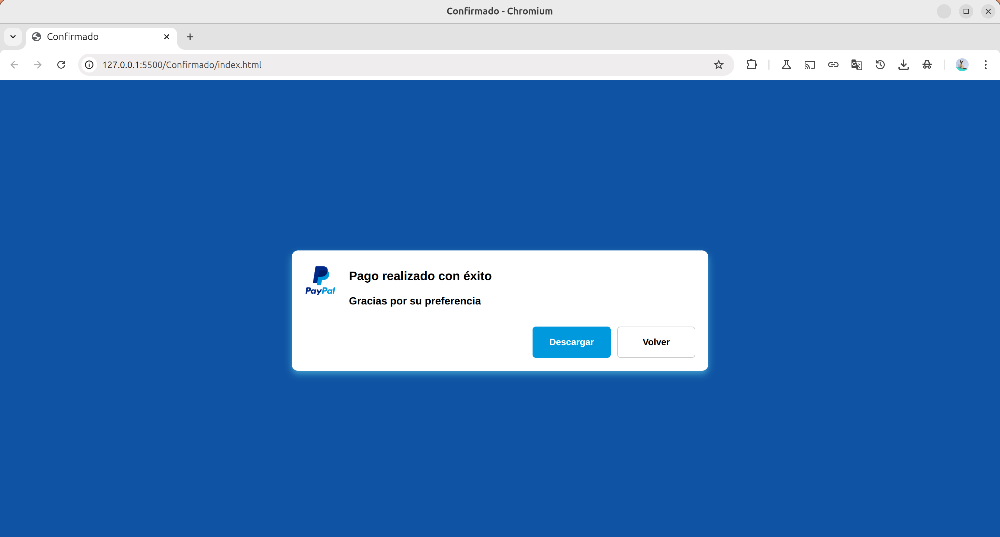

# Página de Confirmación de Pago - PayPal

Una página web de confirmación de pago exitoso con diseño limpio y profesional, integrada con la identidad visual de PayPal.

## 📋 Descripción

Este proyecto presenta una página de confirmación que se muestra después de completar un pago exitoso. La interfaz incluye el logo de PayPal, mensaje de confirmación y botones de acción para mejorar la experiencia del usuario post-transacción.

## 🚀 Características

- **Diseño centrado**: Layout enfocado en el mensaje principal
- **Interfaz limpia**: Diseño minimalista y profesional
- **Branding consistente**: Integración del logo de PayPal
- **Acciones claras**: Botones de descarga y navegación
- **Responsive**: Adaptable a diferentes dispositivos

## 🛠️ Tecnologías Utilizadas

- **HTML5**: Estructura semántica y accesible
- **CSS3**: Estilos y diseño visual (archivo externo)
- **Imágenes PNG**: Logo de PayPal en alta calidad

## 📁 Estructura del Proyecto

```
payment-confirmation/
│
├── index.html              # Página principal de confirmación
├── style.css              # Estilos CSS (archivo requerido)
├── paypal_logo.png        # Logo oficial de PayPal
└── README.md              # Documentación del proyecto
```

## 🎯 Componentes de la Página

### Contenedor Principal
- **Diseño centrado**: Estructura flex/grid para centrado perfecto
- **Sub-contenedor**: Elemento contenedor para el contenido principal

### Sección de Contenido
- **Ícono**: Logo de PayPal (48px de ancho)
- **Mensaje de confirmación**: 
  - Título: "Pago realizado con éxito"
  - Subtítulo: "Gracias por su preferencia"

### Sección de Acciones
Dos botones principales:
- **Descargar**: Para obtener comprobante o producto digital
- **Volver**: Para regresar a la página anterior o inicio

## 🎨 Estructura HTML

### Jerarquía de Elementos
```
contenedor
└── sub-contenedor
    ├── contenido
    │   ├── icon (logo PayPal)
    │   └── mensaje
    │       └── title
    │           ├── h3 (título principal)
    │           └── text (mensaje secundario)
    └── actions
        ├── btn-descargar
        └── btn-volver
```

## 🚀 Instalación y Uso

1. **Descargar** todos los archivos del proyecto
2. **Crear** el archivo `style.css` con los estilos apropiados
3. **Incluir** el logo `paypal_logo.png` en el directorio raíz
4. **Abrir** `index.html` en cualquier navegador web

## 📱 Casos de Uso

- **E-commerce**: Confirmación de compras online
- **Servicios digitales**: Confirmación de suscripciones
- **Donaciones**: Página de agradecimiento
- **Aplicaciones web**: Proceso de checkout

## 🎯 Experiencia de Usuario

### Flujo Típico
1. Usuario completa el pago
2. Es redirigido a esta página de confirmación
3. Ve el mensaje de éxito con branding familiar
4. Puede descargar comprobante o contenido
5. Opción de volver al sitio principal

## 🔧 Mejoras Sugeridas

### Funcionalidad
- [ ] Agregar número de transacción
- [ ] Incluir detalles del pago (monto, fecha)
- [ ] Implementar contador de descarga automática
- [ ] Agregar opción de envío por email

### Diseño
- [ ] Animaciones de confirmación
- [ ] Iconos adicionales (checkmark, etc.)
- [ ] Modo oscuro/claro
- [ ] Efectos hover en botones

### Técnico
- [ ] Validación de datos de transacción
- [ ] Integración con API de PayPal
- [ ] Sistema de logging
- [ ] Compatibilidad con múltiples idiomas

## 🔐 Consideraciones de Seguridad

- **Validación server-side**: Verificar transacción antes de mostrar página
- **Tokens seguros**: Usar parámetros encriptados en URL
- **Tiempo de sesión**: Implementar expiración de página
- **Prevención de acceso directo**: Validar origen de la petición

## 📊 Métricas Recomendadas

- Tasa de conversión post-pago
- Tiempo de permanencia en página
- Clicks en botones de acción
- Abandono vs. finalización del proceso

## 🌐 Compatibilidad

- ✅ Chrome (todas las versiones)
- ✅ Firefox (todas las versiones)
- ✅ Safari (todas las versiones)
- ✅ Edge (todas las versiones)
- ✅ Dispositivos móviles

## 👨‍💻 Notas para Desarrolladores

### HTML Semántico
- Uso correcto de elementos `<div>` con clases descriptivas
- Estructura jerárquica clara y lógica
- Comentarios para secciones principales

### CSS (Pendiente)
- Implementar diseño responsive
- Usar variables CSS para consistencia
- Aplicar principios de diseño centrado
- Considerar accesibilidad (contraste, tamaños)

## 📄 Integración

Esta página típicamente se integra con:
- **Pasarelas de pago**: PayPal, Stripe, etc.
- **Sistemas de e-commerce**: WooCommerce, Shopify
- **APIs de transacciones**: Para validación de pagos
- **Sistemas de email**: Para envío de confirmaciones

## 🔗 Enlaces Relacionados

- [Documentación API PayPal](https://developer.paypal.com/)
- [Guías de UX para checkout](https://baymard.com/checkout-usability)
- [Mejores prácticas de confirmación](https://www.smashingmagazine.com/checkout-optimization/)

---

## 📞 Contacto

- **Autor:** Fernando
- **Email:** fernando.a.h@outlook.com
- **GitHub:** [@Ferglow](https://github.com/Ferglow)

**Nota**: Este proyecto requiere el archivo `style.css` para el diseño visual completo y el logo `paypal_logo.png` para funcionalidad completa.

## Imagen ilustrativa

