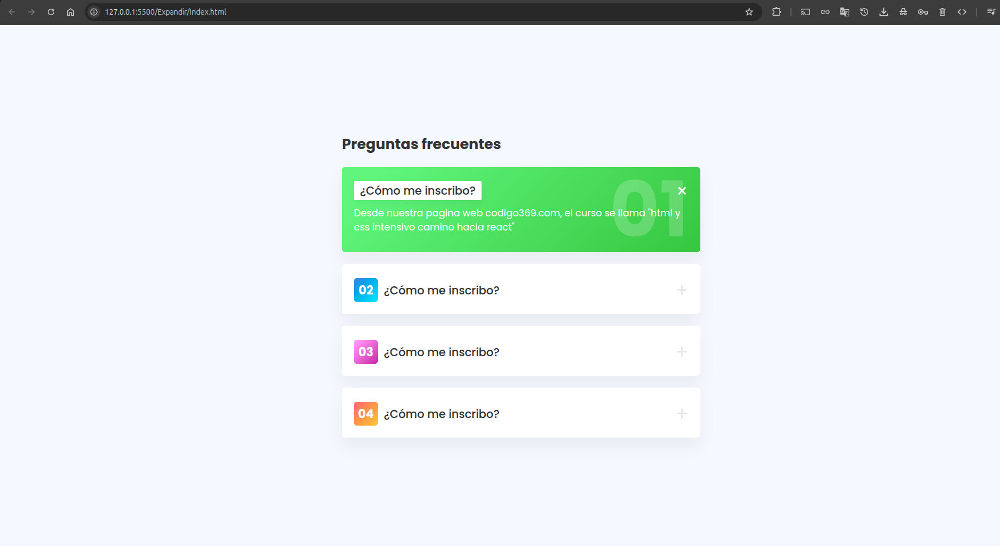

# Acordeón de Preguntas Frecuentes (FAQ)

Un componente de preguntas frecuentes interactivo desarrollado con HTML5 y CSS3 puro, sin necesidad de JavaScript. Utiliza radio buttons para crear un efecto acordeón elegante y funcional.

## 📋 Descripción

Este proyecto presenta un sistema de preguntas frecuentes con efecto acordeón que permite expandir y contraer las respuestas de forma suave. Cada pregunta está numerada y organizada de manera clara, proporcionando una excelente experiencia de usuario para secciones de FAQ en sitios web.

## ✨ Características

- **Solo CSS** - Funcionalidad completa sin JavaScript
- **Efecto acordeón** - Animaciones suaves de expansión/contracción
- **Radio buttons** - Solo una pregunta abierta a la vez
- **Diseño responsive** - Se adapta a diferentes tamaños de pantalla
- **Numeración automática** - Preguntas organizadas y numeradas
- **Accesible** - Navegación por teclado y screen readers
- **Fácil personalización** - Estructura modular y CSS bien organizado

## 🛠️ Tecnologías utilizadas

- **HTML5** - Estructura semántica con inputs radio
- **CSS3** - Estilos modernos, transiciones y animaciones
- **Responsive Design** - Media queries para adaptabilidad
- **Flexbox** - Layout flexible y moderno

## 📁 Estructura del proyecto

```
faq-accordion/
│
├── Index.html        # Página principal
├── css/
│   └── style.css    # Estilos CSS y animaciones
└── README.md        # Documentación del proyecto
```

## 🚀 Instalación y uso

### Método 1: Descarga directa

1. **Descarga o clona el repositorio**
   ```bash
   git clone https://github.com/tu-usuario/faq-accordion.git
   ```

2. **Navega al directorio del proyecto**
   ```bash
   cd faq-accordion
   ```

3. **Abre el archivo Index.html en tu navegador**
   ```bash
   # En Windows
   start Index.html
   
   # En macOS
   open Index.html
   
   # En Linux
   xdg-open Index.html
   ```

### Método 2: Live Server (recomendado para desarrollo)

1. **Instala Live Server** (si usas VS Code)
   - Extensión "Live Server" en VS Code
   - O usa `npm install -g live-server`

2. **Ejecuta el servidor local**
   ```bash
   live-server
   ```

3. **Abre en el navegador**
   ```
   http://localhost:5500
   ```

## 💻 Estructura del HTML

### Componente principal

```html
<section class="container">
    <h1>Preguntas frecuentes</h1>
    
    <!-- Pregunta individual -->
    <div class="tab">
        <input type="radio" name="abrir" id="acc1"/>
        <label for="acc1">
            <h2>01</h2>
            <h3>¿Tu pregunta aquí?</h3>
        </label>
        <div class="content">
            <p>Tu respuesta aquí...</p>
        </div>
    </div>
</section>
```

### Elementos clave:

- **`.container`** - Contenedor principal del FAQ
- **`.tab`** - Cada pregunta/respuesta individual
- **`input[type="radio"]`** - Control de estado (oculto)
- **`label`** - Área clickeable de la pregunta
- **`.content`** - Contenido de la respuesta (expandible)

## 🎨 Personalización

### Agregar nuevas preguntas

Para agregar una nueva pregunta, copia esta estructura:

```html
<div class="tab">
    <input type="radio" name="abrir" id="acc5"/>
    <label for="acc5">
        <h2>05</h2>
        <h3>¿Nueva pregunta?</h3>
    </label>
    <div class="content">
        <p>Nueva respuesta aquí...</p>
    </div>
</div>
```

**Importante:** 
- Cambia el `id` del input (`acc5`)
- Actualiza el `for` del label (`acc5`)
- Mantén el mismo `name="abrir"` para que funcione el acordeón

### Modificar contenido

1. **Títulos de preguntas** - Edita el contenido del `<h3>`
2. **Respuestas** - Modifica el texto dentro de `<p>`
3. **Numeración** - Actualiza el `<h2>` con el número correspondiente

### Personalizar estilos

Edita `css/style.css` para modificar:
- **Colores** - Cambia la paleta de colores del acordeón
- **Tipografía** - Modifica fuentes y tamaños de texto
- **Animaciones** - Ajusta velocidad y tipo de transiciones
- **Espaciado** - Modifica márgenes y padding
- **Efectos hover** - Personaliza interacciones

## 📱 Responsive Design

El acordeón está optimizado para:

- **📱 Mobile** (320px - 768px)
  - Texto adaptado para pantallas pequeñas
  - Espaciado optimizado para touch
  
- **📱 Tablet** (768px - 1024px)
  - Tamaños de fuente intermedios
  - Espaciado equilibrado
  
- **💻 Desktop** (1024px+)
  - Efectos hover completos
  - Espaciado amplio

## 🌐 Compatibilidad

- ✅ Chrome 60+
- ✅ Firefox 55+
- ✅ Safari 12+
- ✅ Edge 79+
- ✅ Opera 47+
- ✅ IE 11 (con limitaciones en animaciones)

## ♿ Accesibilidad

- **Navegación por teclado** - Funciona con Tab y Enter
- **Screen readers** - Labels y estructura semántica
- **Contraste** - Colores accesibles
- **Focus visible** - Indicadores de foco claros

## 🚀 Casos de uso

Este componente es perfecto para:

- **📋 FAQ empresariales** - Preguntas frecuentes de productos/servicios
- **🎓 Sitios educativos** - Preguntas sobre cursos o programas
- **🛍️ E-commerce** - Preguntas sobre envíos, devoluciones, etc.
- **💼 Soporte técnico** - Resolución de problemas comunes
- **📱 Apps** - Secciones de ayuda y soporte
- **🏥 Servicios médicos** - Información para pacientes

## 💡 Ventajas del enfoque CSS-only

- **Rendimiento** - Sin JavaScript, carga más rápida
- **Simplicidad** - Menos código, menos bugs
- **Accesibilidad** - Funciona sin JS habilitado
- **Mantenimiento** - Código más limpio y fácil de mantener

## 🔧 Mejoras futuras

- [ ] Icono de flecha que rote al expandir
- [ ] Múltiples acordeones abiertos simultáneamente
- [ ] Búsqueda en tiempo real
- [ ] Categorización de preguntas
- [ ] Modo oscuro/claro
- [ ] Animaciones más complejas
- [ ] Integración con CMS
- [ ] Estadísticas de preguntas más consultadas

## 📄 Licencia

Este proyecto está bajo la Licencia MIT. Ver el archivo `LICENSE` para más detalles.

## 🤝 Contribuciones

Las contribuciones son bienvenidas. Para contribuir:

1. Fork el proyecto
2. Crea una rama para tu feature (`git checkout -b feature/MejorAnimacion`)
3. Commit tus cambios (`git commit -m 'Add: nueva animación de expansión'`)
4. Push a la rama (`git push origin feature/MejorAnimacion`)
5. Abre un Pull Request

## 📞 Contacto

- **Autor:** Fernando Andres
- **Email:** fernando.a.h@outlook.co,m
- **GitHub:** [@Ferglow](https://github.com/Ferglow)

## 📝 Notas técnicas

- El acordeón usa radio buttons para garantizar que solo una pregunta esté abierta
- Las animaciones CSS proporcionan transiciones suaves
- La estructura es completamente modular y reutilizable
- Compatible con la mayoría de frameworks CSS

---

⭐ Si te gustó este proyecto, ¡dale una estrella en GitHub!

## Imagenes Ilustrativas

