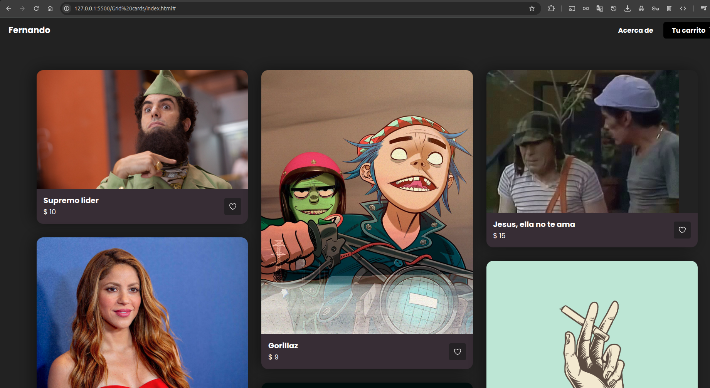

# Grid Cards Store

Una tienda online moderna con diseño de cuadrícula responsiva para mostrar productos de arte y diseño gráfico.

## Descripción

Este proyecto presenta una tienda online con un sistema de cuadrícula responsiva que muestra productos artísticos. La interfaz incluye un header con navegación, logo personalizado, carrito de compras y una galería de productos con funcionalidad de favoritos.

## Características

- **Diseño Responsivo**: Layout de cuadrícula que se adapta a diferentes pantallas
- **Header Navegable**: Logo personalizado y enlace al carrito
- **Iconos Modernos**: Integración con Ionicons para corazón y carrito
- **Tarjetas de Producto**: Diseño limpio con imagen, título y precio
- **Funcionalidad de Favoritos**: Botón de corazón en cada producto
- **Layout en Columnas**: Organización visual en tres columnas
- **Precios Accesibles**: Productos desde $5 hasta $15

## Estructura del Proyecto

```
grid-cards-store/
├── index.html          # Archivo HTML principal
├── css/
│   └── style.css      # Estilos CSS
├── img/
│   ├── img1.jpg       # Imagen "La loba"
│   ├── img2.jpeg      # Imagen "Supremo lider"
│   ├── img3.jpg       # Imagen "Tu dime"
│   ├── img4.jpg       # Imagen "Gorillaz"
│   └── im5.jpg        # Imagen "Jesus, ella no te ama"
└── README.md          # Este archivo
```

## Tecnologías Utilizadas

- **HTML5**: Estructura semántica moderna
- **CSS3**: Estilos y diseño responsivo en cuadrícula
- **Ionicons 5.5.2**: Biblioteca de iconos moderna
- **JavaScript ES6**: Módulos para iconos (opcional)

## Instalación y Uso

1. Clona o descarga el repositorio
2. Asegúrate de tener la estructura de carpetas correcta
3. Coloca todas las imágenes en la carpeta `img/`:
   - `img1.jpg`: La loba
   - `img2.jpeg`: Supremo lider
   - `img3.jpg`: Tu dime
   - `img4.jpg`: Gorillaz
   - `im5.jpg`: Jesus, ella no te ama
4. Abre `index.html` en tu navegador web

## Catálogo de Productos

### Columna 1
- **Supremo lider** - $10
- **La loba** - $9
- **Tu dime** - $9

### Columna 2
- **Gorillaz** - $9
- **Mascara** - $12
- **Gangster** - $5

### Columna 3
- **Jesus, ella no te ama** - $15
- **No fumes** - $5

## Dependencias Externas

### Ionicons
```html
<script type="module" src="https://unpkg.com/ionicons@5.5.2/dist/ionicons/ionicons.esm.js"></script>
<script nomodule src="https://unpkg.com/ionicons@5.5.2/dist/ionicons/ionicons.js"></script>
```

### Iconos Utilizados
- `cart-outline`: Icono del carrito de compras
- `heart-outline`: Icono de favoritos

## Estructura HTML

### Header
- Logo personalizado "Fernando"
- Navegación con enlaces a "Acerca de" y "Tu carrito"

### Main Content
- Contenedor responsivo con cuadrícula
- Tres columnas de productos
- Cada producto incluye:
  - Imagen
  - Título
  - Precio
  - Botón de favoritos

## Personalización

### Cambiar productos
1. Reemplaza las imágenes en la carpeta `img/`
2. Actualiza los títulos en `<h2 class="product-title">`
3. Modifica los precios en `<p class="product-price">`

### Personalizar marca
1. Cambia el logo en `<h1 class="logo">Fernando</h1>`
2. Actualiza el título de la página en `<title>`

### Añadir funcionalidad
1. Conecta los botones de favoritos con JavaScript
2. Implementa carrito de compras funcional
3. Añade sistema de filtros y búsqueda

## Casos de Uso

- **Tienda de arte**: Venta de ilustraciones y diseños
- **Galería online**: Exposición de obras artísticas
- **Marketplace**: Plataforma para artistas independientes
- **Portfolio comercial**: Mostrar trabajos con precios

## Compatibilidad

- Navegadores modernos con soporte para CSS Grid
- Compatible con móviles y tablets
- Soporte para módulos ES6
- Fallback para navegadores sin módulos

## Mejoras Futuras

- **Carrito funcional**: Implementar agregar/quitar productos
- **Sistema de usuarios**: Login y registro
- **Filtros**: Por precio, categoría, popularidad
- **Búsqueda**: Buscador de productos
- **Paginación**: Para catálogos grandes
- **Animaciones**: Transiciones suaves
- **Modo oscuro**: Tema alternativo

## Optimización

- Lazy loading para imágenes
- Compresión de imágenes
- Minificación de CSS
- Service Worker para cache

## Contribución

Si deseas contribuir al proyecto:

1. Fork el repositorio
2. Crea una rama para tu feature (`git checkout -b feature/nueva-caracteristica`)
3. Commit tus cambios (`git commit -am 'Añade nueva característica'`)
4. Push a la rama (`git push origin feature/nueva-caracteristica`)
5. Crea un Pull Request

## Licencia

Este proyecto es de código abierto y está disponible bajo la licencia MIT.

## Autor

Desarrollado como proyecto de práctica para mejorar habilidades en HTML, CSS Grid, y desarrollo de interfaces de e-commerce.

---

*Proyecto creado con fines educativos y de práctica en desarrollo web frontend, diseño responsivo y sistemas de tienda online.*

## Imagenes ilustrativas

