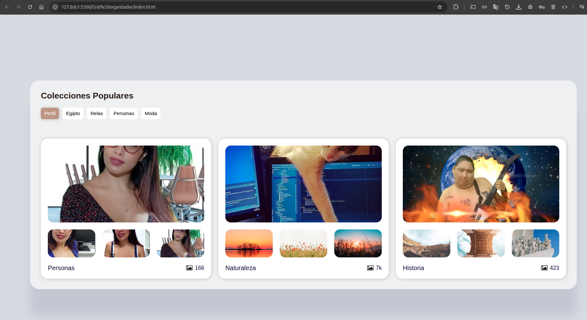

# Grid Organizador - Colecciones Populares

Un organizador de imágenes con diseño de grilla que permite visualizar y categorizar colecciones de imágenes populares.

## 📋 Descripción

Este proyecto es una aplicación web que presenta colecciones de imágenes organizadas en un diseño de grilla moderno y responsivo. Los usuarios pueden navegar entre diferentes categorías como Perfil, Egipto, Relax, Personas y Moda.

## 🚀 Características

- **Diseño Responsivo**: Adaptable a diferentes tamaños de pantalla
- **Navegación por Categorías**: Pestañas para filtrar contenido
- **Vista de Grilla**: Cada colección muestra múltiples imágenes en una disposición atractiva
- **Contador de Imágenes**: Cada colección muestra el número total de imágenes
- **Interfaz Intuitiva**: Diseño limpio y fácil de usar

## 📁 Estructura del Proyecto

```
grid-organizador/
├── index.html
├── css/
│   └── style.css
└── README.md
```

## 🎨 Colecciones Incluidas

### 1. Personas
- **Cantidad**: 166 imágenes
- **Descripción**: Colección de retratos y fotografías de personas

### 2. Naturaleza
- **Cantidad**: 7k imágenes
- **Descripción**: Paisajes, plantas y elementos naturales

### 3. Historia
- **Cantidad**: 423 imágenes
- **Descripción**: Fotografías históricas y elementos culturales

## 🛠️ Tecnologías Utilizadas

- **HTML5**: Estructura semántica
- **CSS3**: Estilos y diseño responsivo
- **JavaScript**: (Funcionalidad pendiente de implementación)

## 📱 Categorías Disponibles

- **Perfil** (Activa por defecto)
- **Egipto**
- **Relax**
- **Personas**
- **Moda**

## 🔧 Instalación y Uso

1. Clona o descarga el repositorio
2. Abre el archivo `index.html` en tu navegador web
3. Navega entre las diferentes categorías usando las pestañas superiores

## 📸 Fuentes de Imágenes

- Imágenes alojadas en servicios externos (ibb.co, Unsplash)
- Iconos de Wikimedia Commons

## 🎯 Próximas Mejoras

- [ ] Implementar funcionalidad de filtrado por categorías
- [ ] Añadir efectos de hover y transiciones
- [ ] Implementar carga lazy para mejorar rendimiento
- [ ] Añadir funcionalidad de búsqueda
- [ ] Implementar modal para vista ampliada de imágenes
- [ ] Optimizar para dispositivos móviles

## 🤝 Contribuciones

Las contribuciones son bienvenidas. Para cambios importantes, por favor abre un issue primero para discutir qué te gustaría cambiar.

## 📄 Licencia

Este proyecto está bajo la Licencia MIT - ver el archivo LICENSE para más detalles.

## 📞 Contacto

Para preguntas o sugerencias, puedes contactar al desarrollador del proyecto.

---

*Desarrollado con ❤️ para organizar y visualizar colecciones de imágenes de manera eficiente.*

## Imagenes ilustrativas

