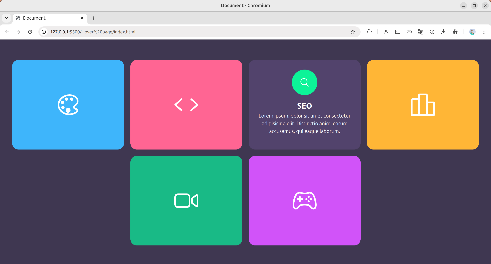

# Showcase de Servicios - Cards Interactivas

Una sección de servicios moderna y atractiva que presenta diferentes servicios digitales con iconos coloridos y diseño responsivo.

## 📋 Descripción

Este proyecto presenta una galería de servicios digitales organizados en cards atractivas. Cada servicio incluye un ícono personalizado con colores únicos, título descriptivo y descripción del servicio. Ideal para portfolios, páginas de agencias digitales o sitios web corporativos.

## 🚀 Características

- **Diseño modular**: Cards reutilizables y escalables
- **Iconos vectoriales**: Integración con Ionicons para iconografía moderna
- **Colores personalizables**: Sistema de variables CSS para cada servicio
- **Layout responsive**: Adaptable a diferentes tamaños de pantalla
- **Carga optimizada**: CDN para iconos con fallback

## 🛠️ Tecnologías Utilizadas

- **HTML5**: Estructura semántica con elementos `<section>`
- **CSS3**: Estilos avanzados con variables CSS custom properties
- **Ionicons 5.5.2**: Biblioteca de iconos vectoriales
- **CSS Variables**: Sistema de colores dinámico (`--i` property)

## 📁 Estructura del Proyecto

```
services-showcase/
│
├── index.html              # Página principal
├── css/
│   └── style.css          # Estilos principales (archivo requerido)
└── README.md              # Documentación del proyecto
```

## 🎯 Servicios Incluidos

### 1. **Design** 🎨
- **Color**: Azul (`#4eb7ff`)
- **Ícono**: `color-palette-outline`
- **Enfoque**: Diseño gráfico y UI/UX

### 2. **Development** 💻
- **Color**: Rosa (`#fd6494`)
- **Ícono**: `code-outline`
- **Enfoque**: Programación y desarrollo web

### 3. **SEO** 🔍
- **Color**: Verde claro (`#43f390`)
- **Ícono**: `search-outline`
- **Enfoque**: Optimización para motores de búsqueda

### 4. **Digital Marketing** 📊
- **Color**: Naranja (`#ffb508`)
- **Ícono**: `podium-outline`
- **Enfoque**: Marketing digital y estrategias online

### 5. **Video Editing** 🎬
- **Color**: Verde (`#37ba82`)
- **Ícono**: `videocam-outline`
- **Enfoque**: Edición y producción audiovisual

### 6. **Games Development** 🎮
- **Color**: Púrpura (`#cd57ff`)
- **Ícono**: `game-controller-outline`
- **Enfoque**: Desarrollo de videojuegos

## 🎨 Sistema de Colores

El proyecto utiliza variables CSS personalizadas para cada servicio:

```css
/* Ejemplos de variables de color */
--i: #4eb7ff;  /* Design - Azul */
--i: #fd6494;  /* Development - Rosa */
--i: #43f390;  /* SEO - Verde claro */
--i: #ffb508;  /* Marketing - Naranja */
--i: #37ba82;  /* Video - Verde */
--i: #cd57ff;  /* Games - Púrpura */
```

## 🔧 Estructura HTML

### Componente ServiceBox
```html
<div class="serviceBox">
    <div class="icon" style="--i:#COLOR;">
        <ion-icon name="ICON_NAME"></ion-icon>
    </div>
    <div class="content">
        <h2>TÍTULO</h2>
        <p>Descripción del servicio...</p>
    </div>
</div>
```

## 📦 Dependencias Externas

### Ionicons CDN
```html
<!-- Módulo ES6 -->
<script type="module" src="https://unpkg.com/ionicons@5.5.2/dist/ionicons/ionicons.esm.js"></script>

<!-- Fallback para navegadores antiguos -->
<script nomodule src="https://unpkg.com/ionicons@5.5.2/dist/ionicons/ionicons.js"></script>
```

## 🚀 Instalación y Uso

1. **Descargar** el proyecto completo
2. **Crear** el archivo `css/style.css` con los estilos necesarios
3. **Personalizar** colores y contenido según necesidades
4. **Abrir** `index.html` en el navegador

## 🎯 Casos de Uso

- **Agencias digitales**: Mostrar servicios ofrecidos
- **Freelancers**: Portfolio de habilidades
- **Empresas tech**: Capacidades técnicas
- **Startups**: Propuesta de valor
- **Consultorías**: Áreas de especialización

## 🔧 Personalización

### Agregar Nuevo Servicio
```html
<div class="serviceBox">
    <div class="icon" style="--i:#TU_COLOR;">
        <ion-icon name="tu-icono-outline"></ion-icon>
    </div>
    <div class="content">
        <h2>Tu Servicio</h2>
        <p>Descripción personalizada...</p>
    </div>
</div>
```

### Cambiar Iconos
Explorar la biblioteca completa en: [Ionicons.com](https://ionicons.com/)

## 📱 Layout Responsivo

El diseño debe adaptarse a:
- **Desktop**: Grid de 3 columnas
- **Tablet**: Grid de 2 columnas
- **Mobile**: Una columna

## 🎨 Mejoras Sugeridas

### Funcionalidad
- [ ] Efectos hover interactivos
- [ ] Animaciones de entrada (AOS, Animate.css)
- [ ] Modal con información detallada
- [ ] Enlaces a páginas específicas de servicio
- [ ] Formulario de contacto integrado

### Diseño
- [ ] Gradientes en los iconos
- [ ] Sombras y efectos de profundidad
- [ ] Animaciones de loading
- [ ] Modo oscuro/claro
- [ ] Microinteracciones

### Contenido
- [ ] Reemplazar Lorem Ipsum con contenido real
- [ ] Añadir precios o información adicional
- [ ] Incluir testimonios o casos de estudio
- [ ] Botones de call-to-action

## 🔍 SEO y Accesibilidad

### Mejoras Recomendadas
- Agregar atributos `alt` descriptivos
- Implementar schema markup para servicios
- Usar headings jerárquicos apropiados
- Asegurar contraste de colores adecuado
- Navegación por teclado

## 🌐 Compatibilidad

- ✅ Chrome (todas las versiones)
- ✅ Firefox (todas las versiones)
- ✅ Safari (todas las versiones)
- ✅ Edge (todas las versiones)
- ✅ Ionicons compatible con todos los navegadores modernos

## ⚡ Performance

### Optimizaciones Aplicadas
- **CDN para iconos**: Carga rápida desde Unpkg
- **Fallback incluido**: Compatibilidad con navegadores antiguos
- **Código limpio**: HTML semántico y eficiente

### Mejoras Adicionales
- [ ] Lazy loading para iconos
- [ ] Compresión de imágenes
- [ ] Minificación de CSS/JS
- [ ] Service Worker para cache

## 📊 Métricas de Conversión

Elementos a trackear:
- Clicks en cada servicio
- Tiempo de permanencia en sección
- Interacciones con hover effects
- Conversiones desde la sección

## 🔗 Integración

Compatible con:
- **CMS**: WordPress, Drupal, etc.
- **Frameworks**: Bootstrap, Tailwind, etc.
- **Analytics**: Google Analytics, Hotjar
- **Marketing**: Lead generation forms

## 👨‍💻 Notas Técnicas

### Variables CSS Personalizadas
El uso de `style="--i:#color"` permite personalización dinámica por elemento, ideal para sistemas de theming.

### Ionicons
- Versión estable 5.5.2
- Soporte para tree-shaking
- Iconos optimizados como SVG
- Accesibilidad integrada

---

**Importante**: Este proyecto requiere conexión a internet para cargar los iconos de Ionicons desde el CDN. Para uso offline, descargar la librería localmente.

## Imagen ilustrativa

