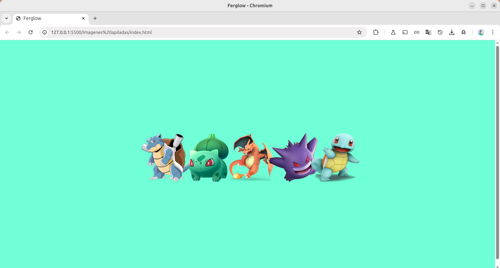

# Ferglow - Galería de Pokémon

Una galería interactiva de Pokémon clásicos con efectos visuales y diseño moderno. Presenta cinco Pokémon icónicos de la primera generación con sus nombres superpuestos.

## 📋 Descripción

Ferglow es una galería visual que muestra algunos de los Pokémon más populares de la primera generación. Cada Pokémon se presenta en una card individual con efectos hover y nombres elegantemente superpuestos sobre las imágenes.

## 🚀 Características

- **Galería responsiva**: Layout adaptable a diferentes pantallas
- **Efectos interactivos**: Hover effects y transiciones suaves
- **Diseño moderno**: Interfaz limpia y atractiva
- **Pokémon clásicos**: Selección de la primera generación
- **Nombres superpuestos**: Texto elegante sobre las imágenes

## 🛠️ Tecnologías Utilizadas

- **HTML5**: Estructura semántica y accesible
- **CSS3**: Estilos avanzados y efectos visuales
- **Imágenes PNG**: Pokémon en alta calidad con transparencia

## 📁 Estructura del Proyecto

```
ferglow-pokemon/
│
├── index.html               # Página principal
├── style.css               # Estilos CSS (archivo requerido)
├── img/                    # Directorio de imágenes
│   ├── blastoise.png       # Pokémon tipo agua
│   ├── bulbasaur.png       # Pokémon tipo planta/veneno
│   ├── charizard.png       # Pokémon tipo fuego/volador
│   ├── gengar.png          # Pokémon tipo fantasma/veneno
│   └── squirtle.png        # Pokémon tipo agua
└── README.md               # Documentación
```

## 🎯 Pokémon Incluidos

### **Blastoise** 🌊
- **Tipo**: Agua
- **Generación**: I
- **Características**: Pokémon Marisco, evolución final de Squirtle

### **Bulbasaur** 🌱
- **Tipo**: Planta/Veneno
- **Generación**: I
- **Características**: Pokémon Semilla, starter de Kanto (#001)

### **Charizard** 🔥
- **Tipo**: Fuego/Volador
- **Generación**: I
- **Características**: Pokémon Llama, evolución final de Charmander

### **Gengar** 👻
- **Tipo**: Fantasma/Veneno
- **Generación**: I
- **Características**: Pokémon Sombra, evolución final de Gastly

### **Squirtle** 💧
- **Tipo**: Agua
- **Generación**: I
- **Características**: Pokémon Tortuguita, starter de Kanto

## 🎨 Estructura HTML

### Contenedor Principal
```html
<div class="imagenes-container">
    <!-- Cards de Pokémon -->
</div>
```

### Card Individual
```html
<div class="imagen">
    
    <span class="nombre">
        <span class="text">nombre pokemon</span>
    </span>
</div>
```

## 🚀 Instalación y Uso

1. **Clonar o descargar** el proyecto
2. **Crear el archivo CSS** `style.css` con los estilos necesarios
3. **Agregar las imágenes** de Pokémon en el directorio `img/`
4. **Abrir** `index.html` en cualquier navegador

## 🎯 Casos de Uso

- **Portfolios de diseño**: Demostrar habilidades en CSS y layout
- **Sitios de fans**: Tributo a Pokémon clásicos
- **Aprendizaje**: Ejemplo de galería con hover effects
- **Componentes reutilizables**: Base para galerías similares

## 🔧 Personalización

### Agregar Nuevo Pokémon
```html
<div class="imagen">
    
    <span class="nombre">
        <span class="text">nuevo pokemon</span>
    </span>
</div>
```

### Modificar Estilos
- **Layout**: Cambiar grid o flexbox properties
- **Hover effects**: Personalizar transiciones y transformaciones
- **Tipografía**: Ajustar fuentes y tamaños de texto
- **Colores**: Adaptar palette según preferencias

## 📱 Diseño Responsivo

### Breakpoints Sugeridos
- **Desktop**: 5 columnas (1200px+)
- **Laptop**: 4 columnas (992px - 1199px)
- **Tablet**: 3 columnas (768px - 991px)
- **Mobile**: 2 columnas (576px - 767px)
- **Small Mobile**: 1 columna (<576px)

## 🎨 Mejoras Sugeridas

### Funcionalidad
- [ ] Modal con información detallada del Pokémon
- [ ] Filtros por tipo de Pokémon
- [ ] Búsqueda por nombre
- [ ] Animaciones de carga
- [ ] Lazy loading para imágenes

### Efectos Visuales
- [ ] Animaciones de entrada staggered
- [ ] Efectos de parallax
- [ ] Partículas o efectos de fondo
- [ ] Transiciones más sofisticadas
- [ ] Efectos de glow/resplandor

### Contenido
- [ ] Más Pokémon de diferentes generaciones
- [ ] Información de stats (HP, Attack, etc.)
- [ ] Efectos de sonido
- [ ] Integración con PokéAPI
- [ ] Sistema de favoritos

## 🔍 SEO y Accesibilidad

### Mejoras Implementadas
- ✅ Atributos `alt` descriptivos
- ✅ Estructura HTML semántica
- ✅ Meta tags básicos

### Mejoras Pendientes
- [ ] Atributos ARIA para interactividad
- [ ] Navegación por teclado
- [ ] Texto alternativo más descriptivo
- [ ] Schema markup para contenido
- [ ] Optimización de imágenes

## ⚡ Performance

### Optimizaciones Recomendadas
- **Compresión de imágenes**: WebP format para mejor rendimiento
- **Lazy loading**: Cargar imágenes según scroll
- **CSS crítico**: Inline critical CSS
- **Minificación**: Comprimir HTML/CSS
- **CDN**: Servir imágenes desde CDN

## 🌐 Compatibilidad

- ✅ Chrome (todas las versiones)
- ✅ Firefox (todas las versiones)
- ✅ Safari (todas las versiones)
- ✅ Edge (todas las versiones)
- ✅ Dispositivos móviles

## 🎭 Inspiración y Referencias

### Pokémon Oficiales
- [Pokémon Company](https://www.pokemon.com/)
- [Pokédex Nacional](https://www.pokemon.com/el/pokedex/)
- [PokéAPI](https://pokeapi.co/) - Para datos adicionales

### Diseño Web
- Galerías de imágenes modernas
- Hover effects CSS
- Grid layouts responsivos

## 📊 Métricas y Analytics

### KPIs Sugeridos
- Tiempo de permanencia en la página
- Interacciones con hover effects
- Clicks en cada Pokémon
- Tasa de rebote
- Rendimiento de carga

## 🔗 Posibles Integraciones

- **PokéAPI**: Datos dinámicos de Pokémon
- **Firebase**: Sistema de usuarios y favoritos
- **Analytics**: Google Analytics o similar
- **Social**: Compartir Pokémon favoritos
- **PWA**: Convertir en aplicación web progresiva

## 👨‍💻 Notas para Desarrolladores

### Estructura CSS Esperada
```css
.imagenes-container {
    /* Grid/Flexbox layout */
}

.imagen {
    /* Container styles */
    position: relative; /* Para posicionamiento del nombre */
}

.nombre {
    /* Overlay positioning */
    position: absolute;
}

.text {
    /* Typography styles */
}
```

### Consideraciones Técnicas
- **Aspect ratio**: Mantener proporción de imágenes
- **Overflow**: Manejar contenido que desborde
- **Z-index**: Correcta superposición de elementos
- **Performance**: Optimizar para múltiples imágenes

---

**Nota de Copyright**: Las imágenes de Pokémon son propiedad de The Pokémon Company. Este proyecto es solo para fines educativos y de demostración.

## Imagen ilustrativa

