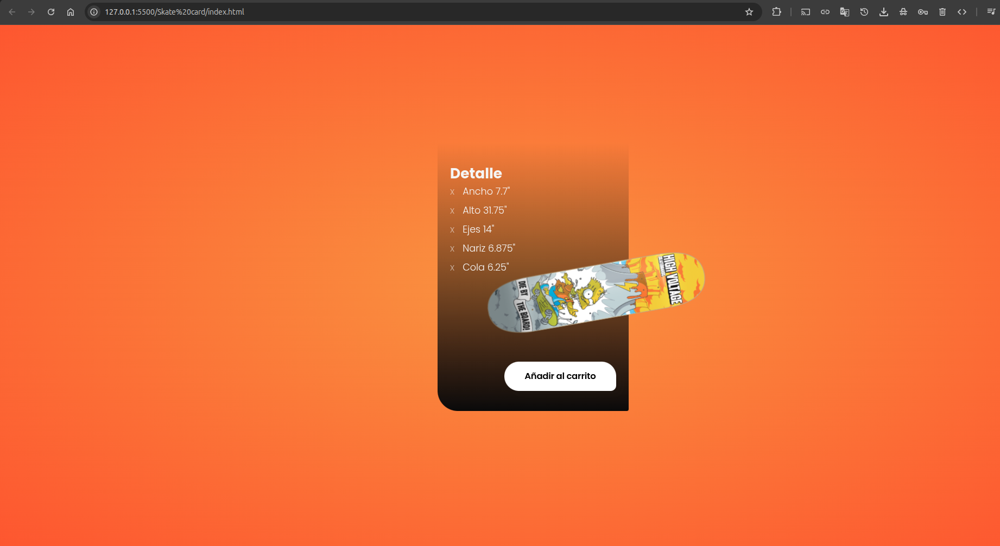

# Skate Product Card

Una tarjeta de producto moderna y elegante para mostrar información detallada de una tabla de skate con diseño responsivo.

## Descripción

Este proyecto presenta una tarjeta de producto interactiva que muestra información completa sobre una tabla de skate. La tarjeta incluye especificaciones técnicas, precio y funcionalidad de carrito de compras con un diseño moderno y atractivo.

## Características

- **Diseño Moderno**: Interfaz limpia y profesional
- **Layout Dividido**: Información del producto y imagen separadas
- **Especificaciones Técnicas**: Medidas detalladas de la tabla
- **Precio Destacado**: Visualización clara del costo
- **Botón de Acción**: Funcionalidad "Añadir al carrito"
- **Favicon Personalizado**: Icono de skate en la pestaña del navegador
- **Diseño Responsivo**: Adaptable a diferentes dispositivos

## Estructura del Proyecto

```
skate-card/
├── index.html          # Archivo HTML principal
├── css/
│   └── style.css      # Estilos CSS
├── img/
│   └── skate.png      # Imagen del skate y favicon
└── README.md          # Este archivo
```

## Tecnologías Utilizadas

- **HTML5**: Estructura semántica moderna
- **CSS3**: Estilos y diseño responsivo
- **Favicon**: Icono personalizado para la pestaña del navegador

## Instalación y Uso

1. Clona o descarga el repositorio
2. Asegúrate de tener la estructura de carpetas correcta
3. Coloca la imagen del skate en la carpeta `img/`:
   - `skate.png`: Imagen del producto y favicon
4. Abre `index.html` en tu navegador web

## Contenido de la Tarjeta

### Información Principal
- **Producto**: Skate 7.7 base
- **Año**: 2023
- **Precio**: $89.00

### Especificaciones Técnicas
- **Ancho**: 7.7"
- **Alto**: 31.75"
- **Ejes**: 14"
- **Nariz**: 6.875"
- **Cola**: 6.25"

### Funcionalidades
- Botón "Añadir al carrito" para e-commerce
- Diseño visual atractivo con imagen del producto

## Estructura HTML

El proyecto utiliza elementos semánticos:
- `<main>`: Contenedor principal
- `<div class="card">`: Tarjeta con información del producto
- `<div class="front">`: Sección frontal con título y precio
- `<div class="rigth">`: Sección lateral con detalles
- `<div class="img-container">`: Contenedor de la imagen

## Personalización

Para adaptar la tarjeta a otro producto:

1. **Cambiar el producto**:
   - Modifica el título en `<h1>Skate</h1>`
   - Actualiza las especificaciones en la lista `<ul>`
   - Cambia el precio en `<p class="price">`

2. **Actualizar imagen**:
   - Reemplaza `skate.png` con la imagen de tu producto
   - Mantén el mismo nombre o actualiza las referencias

3. **Personalizar estilos**:
   - Edita `css/style.css` para cambiar colores, fuentes y layout
   - Ajusta el diseño según tus necesidades

## Casos de Uso

- **Tienda online**: Mostrar productos de skate y deportes
- **Catálogo digital**: Presentar especificaciones técnicas
- **Portfolio**: Demostrar habilidades en diseño web
- **Prototipo**: Base para desarrollo de e-commerce

## Compatibilidad

- Navegadores modernos (Chrome, Firefox, Safari, Edge)
- Diseño responsivo para móviles y desktop
- Compatible con HTML5 y CSS3
- Soporte para favicon en todos los navegadores principales

## Mejoras Futuras

- Integración con carrito de compras funcional
- Animaciones CSS para interacciones
- Galería de imágenes del producto
- Sistema de variantes (colores, tamaños)
- Integración con API de pagos

## Contribución

Si deseas contribuir al proyecto:

1. Fork el repositorio
2. Crea una rama para tu feature (`git checkout -b feature/nueva-caracteristica`)
3. Commit tus cambios (`git commit -am 'Añade nueva característica'`)
4. Push a la rama (`git push origin feature/nueva-caracteristica`)
5. Crea un Pull Request

## Licencia

Este proyecto es de código abierto y está disponible bajo la licencia MIT.

## Autor

Desarrollado como proyecto de práctica para mejorar habilidades en HTML, CSS y diseño de interfaces de usuario.

---

*Proyecto creado con fines educativos y de práctica en desarrollo web frontend y diseño de e-commerce.*

## Imagen ilustrativa

