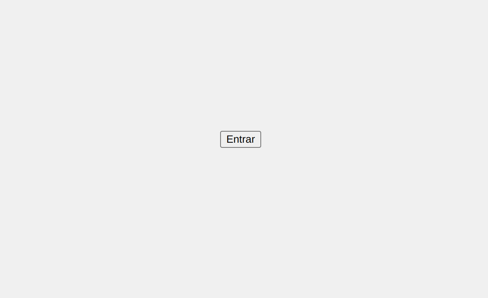

# Proyecto Botón Entrar

Este proyecto incluye un botón "entrar" minimalista y responsivo, diseñado para ser utilizado en aplicaciones web. A continuación se detallan los archivos que componen el proyecto y sus respectivas funcionalidades.

## Estructura del Proyecto

```
boton-entrar-proyecto
├── src
│   ├── index.html        # Estructura principal del documento HTML
│   ├── css
│   │   └── style.css     # Estilos para el botón "entrar" y otros elementos
│   └── js
│       └── main.js       # Código JavaScript para manejar eventos
└── README.md             # Documentación del proyecto
```

## Instrucciones para Ejecutar el Proyecto

1. **Clonar el Repositorio**: Clona este repositorio en tu máquina local.
   
   ```bash
   git clone <URL_DEL_REPOSITORIO>
   ```

2. **Navegar a la Carpeta del Proyecto**: Accede a la carpeta del proyecto.

   ```bash
   cd boton-entrar-proyecto
   ```

3. **Abrir el Archivo HTML**: Abre el archivo `src/index.html` en tu navegador web.

4. **Interacción con el Botón**: Haz clic en el botón "entrar" para ver la funcionalidad implementada.

## Descripción de Funcionalidad

El botón "entrar" está diseñado para ser minimalista y responsivo, adaptándose a diferentes tamaños de pantalla. El estilo y la funcionalidad se pueden personalizar fácilmente a través de los archivos CSS y JavaScript incluidos en el proyecto.

## Contribuciones

Las contribuciones son bienvenidas. Si deseas mejorar este proyecto, por favor abre un "issue" o envía un "pull request".


